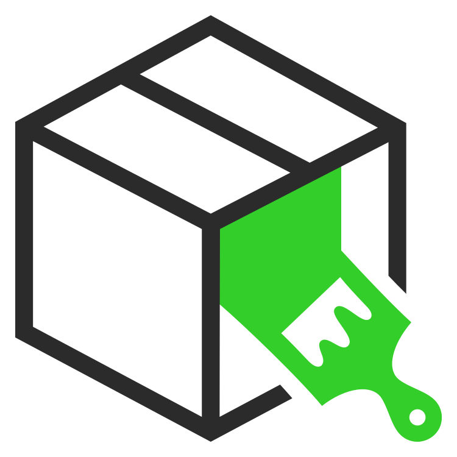
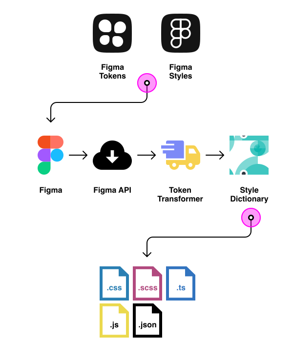

<div align="center">
  <a href="https://github.com/frog/figma-token-engine">
    
  </a>

  <h3 align="center"><strong>Figma Tokens Engine</strong></h3>
  <p align="center">
    Transform Figma Tokens into usable styles
  </p>

</div>

<br/>

## 🚛 About Figma Token Engine

The Figma Token Engine is a project dependency that transforms the export of [Figma Tokens](https://www.figma.com/community/plugin/843461159747178978/Figma-Tokens) into CSS styles thanks to [token-transformer](https://www.npmjs.com/package/token-transformer) and [style-dictionary](https://github.com/amzn/style-dictionary).

<div align="center">
  
</div>

<br/>

## 📓 Config Files

The Figma Token Engine (FTE) requires two files which can be created using `npx figma-token-engine --init`.

The two files helps the FTE to access the Figma API and to know where to find and save the files you need.

First, `.tokens.config.json` tells the FTE which approach will use (FigmaTokens or FigmaStyles), the output directory and the platforms we need to support.

```json
{
  "tokenFormat": "FigmaTokens",
  "figmaFileId": "",
  "inputFile": "./figma-tokens.json",
  "outputDir": "./src/styles/tokens",
  "platforms": [
    "css",
    "cssAutocomplete",
    "scss",
    "scssMap",
    "less",
    "js",
    "ts",
    "json"
  ]
}
```

Secondly, the `.env` exposes sensitive data we might not want to have in our repository such as the Figma API Key and the Figma file which we are pulling data from.

```sh
# Your personal Figma Personal Access token https://www.figma.com/developers/api#access-tokens
FIGMA_PERSONAL_ACCESS_TOKEN=""

# URL of the Figma file with the Figma Tokens configured
FIGMA_FILE_URL=""
```

<br/>

## 🚀 How to use

Download this repository, install dependencies, build and link it to your global npm packages:

```sh
git clone https://github.com/frog/figma-token-engine
cd figma-token-engine
npm install
npm run build
npm link
```

Now it can be used in stand-alone projects using `npx`.

```sh
npx figma-token-engine --init
```

<br/>

## 💻 Commands

### **Default**

Use the default tool configuration with:

```sh
npx figma-token-engine
```

> If you don't have the `.tokens.config.js`file and the needed environment secrets in the `.env` you will need to initialize the project with the --init option.

<br/>

### **Initialize project**

```sh
npx figma-token-engine --init
```

This will create or update two files: `.tokens.config.json` and `.env`, which are required for the tool to work.

Update the configuration file and the enviroment variables with your current project needs.

<br/>

### **Custom Configuration file**

You can also pass your custom configuration file:

```sh
npx figma-token-engine --config .dev-tokens.config.json
```

<br/>

### **Multiple custom Configuration file**

Or pass an array for multiple projects:

```sh
npx figma-token-engine --config .angular-tokens.config.json .react-tokens.config.json .android-tokens.config.json
```

<br/>

### **Fetch API Data**

If you want to fetch data from the Figma API, use:

```sh
npx figma-token-engine
```

<br/>

## 📝 Example: Create a React App and install Figma token Engine

First follow the instructions detailed in "How To Use". Then, we will create a fresh React app and will init the Figma Token Engine.

```sh
npx create-react-app@latest app-react
cd app-react
npx figma-token-engine --init
```

This will create or update two files: `.tokens.config.json` and `.env`, which are required for the tool to work. Add the required information in both files to continue.

If you added the FIGMA_PERSONAL_ACCESS_TOKEN and FIGMA_FILE_URL you can fetch the tokens into the `inputFile` file defined at the token file config `.tokens.config.json`.

```sh
npx figma-token-engine
```

<br/>

## 🧰 Development

To start development of this tool, you need to take into account two thigs: The shell interaction happens in the file `bin/fte.js` while the rest of the project is a Typescript Node Tool.

### Development Environment

Simple development environment:

```sh
npm run dev
```

Development environment with API Fetch:

```sh
npm run dev:api
```

Development environment of the init option:

```sh
npm run dev:init
```

<br/>

## 🤝 Contribute

Contributions will open after the alpha release of this stack. Contact us if you have any questions.

<br/>

## 🧑‍💻 Team

- [daniel.casado](mailto:daniel.casado@frogdesign.com) - [GitHub](https://github.com/daniel-casado) (Sr. Design Technologist)
- [jose.lugo](mailto:jose.lugo@frogdesign.com) - [GitHub](https://github.com/chepetime) (Sr. Design Technologist)

<br/>

---

Made by frog 🐸 Mexico 🇲🇽
